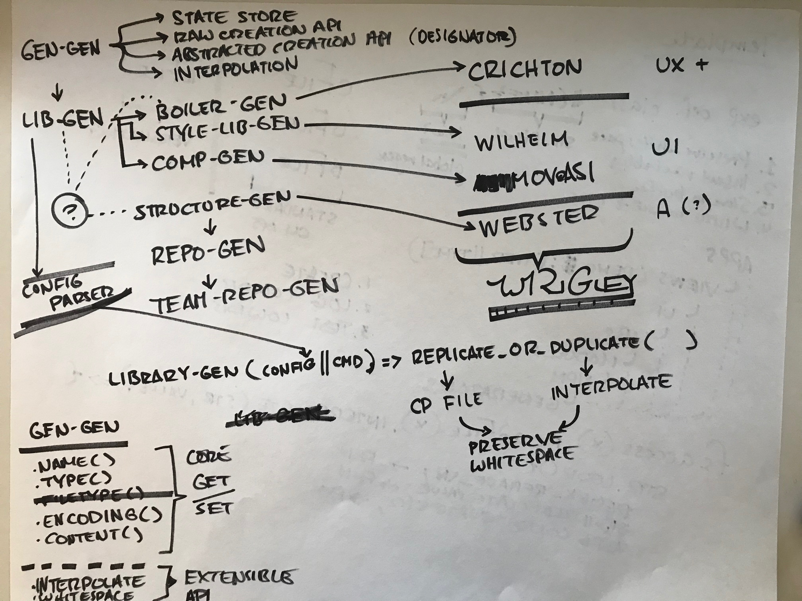
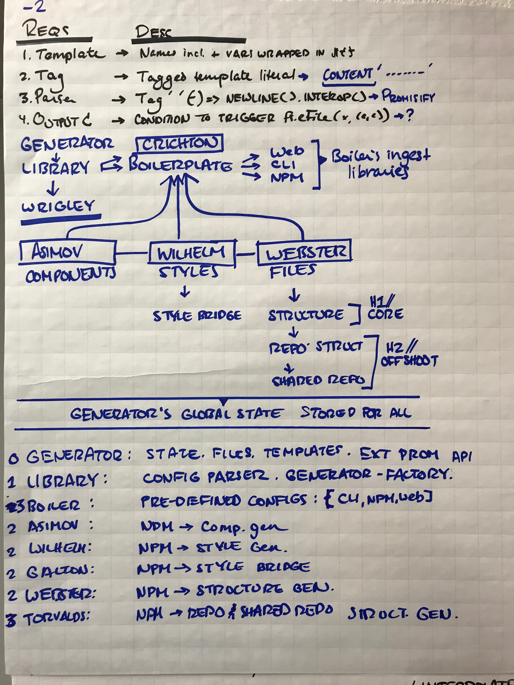
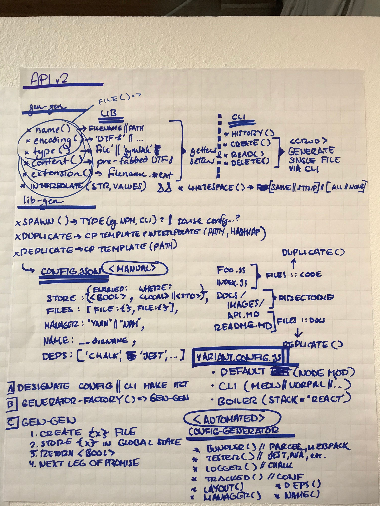

# API

I realize that I've been catering to a wide use case because I haven't took the time to understand the purpose of generator-generator. I marked it as the bedrock of file generation, but stopped there.... In order to get the API right here, must first evaluate the purpose of the API.

## Use case (broad spectrum)

* Generate new files from scratch
* Replicate file templates
* Duplicate file templates with variadic interpolationo

## How will it be extended (myopic)

* Generate libraries (library-generator) :: Webster
* Generate boilerplate (boilerplate-generator) :: Crichton
* Generate file structures (structure-generator) :: Webster
* Generate UI / style libraries (style-library-generator) :: Wilhelm
* Generate components (component-generator) :: Wilhelm

---

## First brainstorm attempt



The primary purpose of library generator will be to create file structures, replicate necessary dependencies like package.json and more.

What differentiates library from boilerplate? Library's purpose is to be included in another application (whether that's a CLI, web app, or other). Boilerplate on the other hand consumes generated library.

### Hierarchy

| Index | Name                  | Description                       |
| :---- | :-------------------- | :-------------------------------- |
| 0     | generator-generator   | generates raw files               |
| 1     | library-generator     | generates importable node modules |
| 2     | boilerplate-generator | generates                         |

## Second brainstorm



> Thinking more deeply about inheritance

The only generator I'm not sure about at this point is Crichton (ie. boilerplate-generator). I think it's the abstraction generator which wraps all other Wrigley design patterns and produces single boilerplates. But I'm not sure.

I think what makes sense is to focus exclusively on `generator-generator` and `library-generator` Bring those two to completion and then move onto the rest.

## Third brainstorm

> Considering the actual API for library-gen & generator-gen



* Config generator is new addition
* Could make config-parser its own module
  * Or perhaps it makes more senes to just include parser in generator?
    * Less modular that way. Just break apart. Follow the same pattern of splitting that style-gen and style-bridge are following.


    # generator-generator-lib

<!-- TOC START min:1 max:3 link:true update:true -->

* [generator-generator-lib](#generator-generator-lib)
  * [FAQ](#faq)
  * [API](#api)
    * [File Types](#file-types)
    * [Abstracted::API](#abstractedapi)
    * [Detailed::API](#detailedapi)

<!-- TOC END -->

## FAQ

> Why make this?

1. Abstract away all of the usual file read/write nonsense that has been implemented a million times.
2. Prevent dependencies from being needlessly bloated
3. Prevent future decisions on which file CRUD libraries to use going forward

## API

| What                          | Why                                 |
| :---------------------------- | :---------------------------------- |
| [File Types](#file-types)     | All possible generated file types   |
| [Abstraction](#abstractedapi) | Abstracted, recommended API         |
| [Detail](#detailedapi)        | Core functionality being abstracted |

---

### File Types

> Below are all of the possible file types

| What     | Why                                        |
| :------- | :----------------------------------------- |
| Plain    | Accept standard string (or empty string)   |
| Template | Easily replace variables within given text |
| Symlink  | Connect things with other things           |

> Below is a flushed out list of file types and their values

```js
{
  "fType": {
    "plain": {
      "content": string
    },
    "template": {
      "content": {
        "keys": variablesToReplace,
        "values": contentToReplaceVariablesWith,
      }
    },
    "symlink": {
      "content": {
        "src": "/path/to/original/file",
        "dest": "./created-symlink"
      }
    }
  }
}
```

### Abstracted::API

<!--
QUESTION: I'm not sure this API makes sense anymore...
-->

> The functions below are an amalgam of file, directory and content manipulation. They work with respective [file types](#file-types).

* [write](#write)
* [read](#read)
* [delete](#delete)

#### write

> write(fName, fContent, fType)

| Parameter  | Type         | Example                                     |
| :--------- | :----------- | :------------------------------------------ |
| `fPath`    | string       | `foo/bar/file.ext`                          |
| `fContent` | string       |                                             |
| `fType`    | enum::string | `plain` (default), `template`, or `symlink` |

##### Examples

| Call                                           | Result                        |
| :--------------------------------------------- | :---------------------------- |
| `write('foo/bar/file.ext', content, template)` | => `foo/bar/file.ext` created |

---

#### read

> read(fPath)

| Parameter | Type   | Example            |
| :-------- | :----- | :----------------- |
| `fPath`   | string | `foo/bar/file.ext` |

##### Examples

| Call               | Result |
| :----------------- | :----- |
| `foo/bar/file.ext` | ?      |

---

##### Examples

| Call                                      | Result                            |
| :---------------------------------------- | :-------------------------------- |
| `update('/foo/bar/file.ext', newContent)` | => `/foo/bar/file.ext` is updated |

---

#### delete

> delete(fPath)

| Parameter | Type   | Example            |
| :-------- | :----- | :----------------- |
| `fPath`   | string | `foo/bar/file.ext` |

##### Examples

| Call                         | Result                                   |
| :--------------------------- | :--------------------------------------- |
| `delete('foo/bar/file.ext')` | => `foo/bar/file.ext` is deleted         |
| `delete('foo/bar/')`         | => `foo/bar/` dir is recursively deleted |

---

---

### Detailed::API

> Below is sample output rendered independently by each file. This is what you can produce without using the abstracted API's.

#### File

> [File.js](./file.js)

| Result     | Type    |
| :--------- | :------ |
| `file.ext` | UTF-8   |
| `file`     | Symlink |

#### Content

> [Content.js](./content.js)

| Result     | Type     | Description                                       |
| :--------- | :------- | :------------------------------------------------ |
| `file.ext` | Plain    | File is populated UTF-8 via initial write-file cb |
| `file.ext` | Template | File from template with interpolated variables    |
| `file.ext` | Symlink  | Symlink is created, pointing to dest file         |

---
