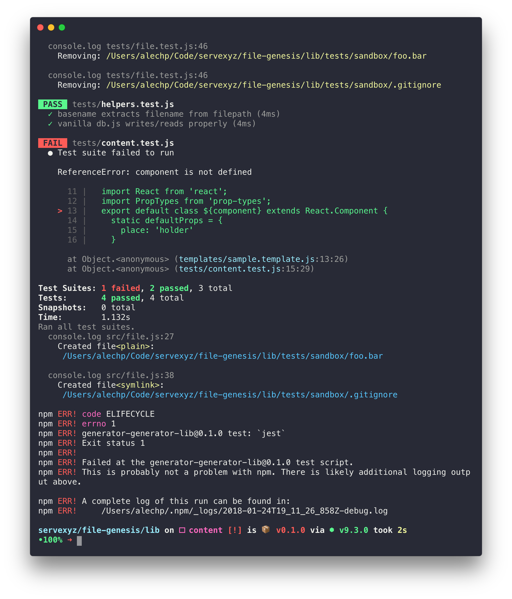

# Debug

## Interpolate templates plan

### Issues



### Brainstorm

> See [todo](./todo.md) for action items
> See [this](https://stackoverflow.com/questions/29182244/convert-a-string-to-a-template-string) for relevant discussion

**Template**

```
export const SAMPLE_TEMPLATE = `
  //file: "sample.template.js"
  import React from 'react';
  import PropTypes from 'prop-types';
  export default class ${component} extends React.Component {
    static defaultProps = {
      place: 'holder'
    }
    static propTypes = {
      place: React.PropTypes.string.isRequired
    }
    state = {
      foo: 'bar'
    }
    constructor(props) {
      super(props);
    }
    render() {
      return (
        <div>
          { this.state.foo }
        </div>
      )
    }
  }
`;
```

* 1st let filename = "sample.template.js";
* 2nd let template =

```
import React from 'react';
  import PropTypes from 'prop-types';
  export default class ${component} extends React.Component {
    static defaultProps = {
      place: 'holder'
    }
    static propTypes = {
      place: React.PropTypes.string.isRequired
    }
    state = {
      foo: 'bar'
    }
    constructor(props) {
      super(props);
    }
    render() {
      return (
        <div>
          { this.state.foo }
        </div>
      )
    }
  }
```

What happens when you run a string literal function over this since it has been extracted into a var? Will it fail? Wondering because I had similar issues when returning new String before. Has to do with the way that string literals parse over this.
